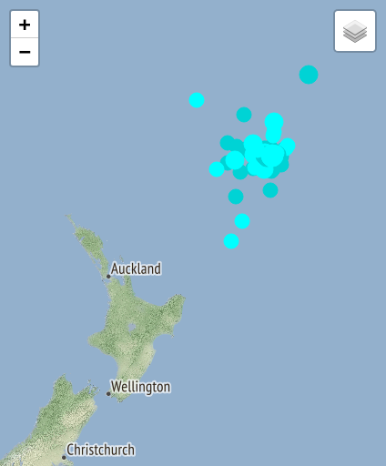
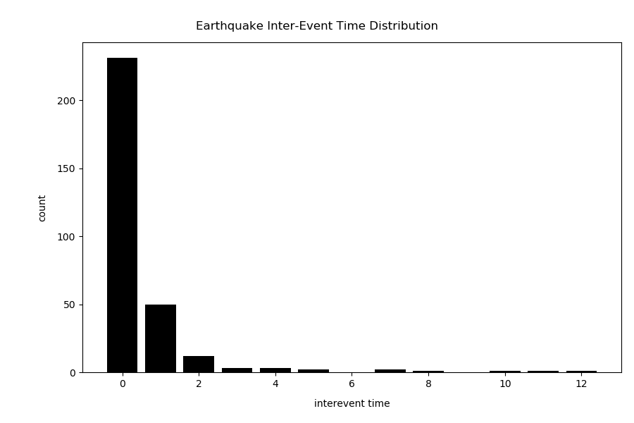
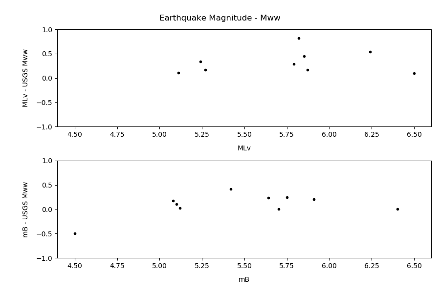

# Kermadec Earthquake Sequence, March 2019

Sam Taylor-Offord

### Overview

On March 7th 2019 an earthquake sequence began in the Kermadec Arc to the south-east of Raoul Island (Figure 1). Earthquake hypocentres and focal mechanicms suggested that the sequence was occurring on - or on splays parallel to - the plate interface in the region. However, the putative poor quality of earthquake locations in the area made any analysis based on absolute hypocentres difficult. As the sequence played out, concerns grew that the earthquakes were increasing the likelihood of a large, tsunamigenic earthquake in the region. Chris Van Houtte, the Seismic Duty Officer during the initial phase of the sequence, raised the need for enhanced monitoring of the sequence, and produced plots highlighting certain aspects of the sequence. The sequence continued into the next duty week, at which point I took over as Seismic Duty Officer. I love data analysis, and understanding the nature and threat potential of an ongoing earthquake sequence is of obvious value to me, so the GeoHazard Analysts (GHAs) and I set off on a journey together to characterise the sequence and understand a little better how the Seismic Duty Officer and the GeoHazard Analysts could work together on earthquake and tsunami monitoring outside of a response.

***Figure 1:** "Crustal" (<50 km) earthquakes in the GeoNet catalogue from the 3rd of March 2019 in the vicinity of the March 2019 Kermadec Sequence. Screenshot from GeoNet Quake Search.*

### GHA Work Item

On Monday 11th March I asked the GHAs to begin searching the traces at GLKZ, a seimometer on Raoul Island, for waveforms from earthquakes in the sequence. Once identified, the GHAs were to note if the earthquake had produced an automatic origin in SeisComp3 as well as other details, such as the earthquake's magnitude. The GHAs worked through all GLKZ data between the 3rd and 10th of March, producing the study dataset used in this analysis report. While scouring the GLKZ data up until this current day, the 18th of March, would produce a more complete dataset, the dimished activity in the sequence from the 11th of March and the changing focus of seismic activity made this low value and as such it was not carried out.

### Sequence Analysis Results

The largest event in the sequence is a Mw 6.4. The overall Mw of the sequence between 03/03/2019 - 11/03/2019 is 6.6. Below are six figures (Figures 2-7) showing different aspects of the sequence:

 

***Figure 2:** Earthquake magnitude over time for all events in the sequence.*

***Figure 2:** Magnitude distribution for earthquakes in the sequence for events that were manually (bottom bars) and automatically (top bars) detected.*

***Figure 3:** Cumulative sum time series for number of earthquakes (top) and moment release (bottom) for earthquakes in the sequence.*

***Figure 5:** Distance-Time plot for all earthquakes in the sequence, with distance calculated using arc lengths on a sphere with radius 6371 km.*

***Figure 6:** Earthquake inter-event time distribution (in hours) for all events in the sequence. Inter-event times are rounded to the nearest hour before the distribution is calculated.*

 

***Figure 7:** Magnitude comparisons for all earthquakes in the sequence that have a USGS Mww magnitude.*

### Sequence Characteristics

1. The sequence began with a Mw 6.4 event on March 7th 2019 (Figure 2).
1. Most earthquakes and moment release occurred in the first day after the main event (Figure 3), and between March 9-11 the rate of event occurrence and moment release was sustained and low (Figure 3). There was no clear precursory earthquake activity prior to the main event (Figure 3).
1. Most detected earthquakes in the sequence are between M4-6, with the automatic detection catalogue being most complete at the higher end of magnitudes (Figure 4).
1. Earthquakes in the sequence tend to occur within 0-100 km of the main event, and no migration in hypocentres is observed over the study period (Figure 5).
1. Earthquakes in the sequence occur predominantly within 1-3 hours of a preceding earthquake, with most events occurring within 30 minutes of their preceding event (Figure 6).
1. MLv magnitudes calculated for earthquakes in the sequence overestimate Mw by 0.1-0.8 units (Figure 7). By the same comparison, mB magnitudes overestimate Mw by 0-0.5 units (Figure 7).

### Conclusion

The March 2019 Kermadec earthquake sequence appears as a mainshock-aftershock sequence with no foreshocks. The GeoNet automatic detection system detects the larger earthquakes in the sequence, but misses the majority of earthquakes above M4.

### Lessons

- When assigning monitoring work to the GHAs, the desired output needs to be specified in detail to avoid later confusion and rework.
- When the GHAs undertake work such as this, they should commit all manually detected events to the catalogue so that data can be gathered via FDSN for analysis.
- When assigning monitoring work to the GHAs, size it so that it can be completed within a couple of days as ongoing monitoring, variability in staff numbers, priority fade, and the requirements of preexisting work will cause the work rate to regularly stall and reduce over time. That said, the GHAs work 24/7 and are a skilled, intelligent, and motivated workforce, making them a powerful weapon for information gathering and advanced analytics!